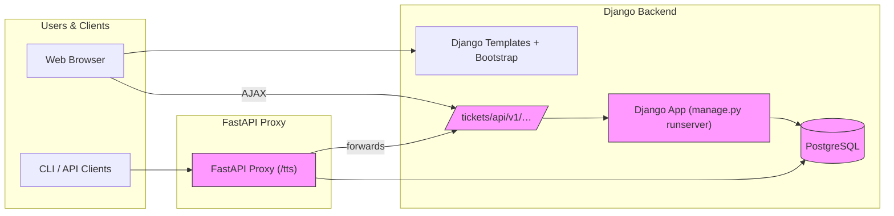

# Architecture Overview

## 1. README Summary  
Key points extracted from [`README.md`](README.md:1–91):
- **Project**: Ticket Tracking System (TTS)  
- **Stack**: Django + SQLAlchemy ORM, server-side rendered with Django Templates + Bootstrap  
- **Features**:  
  - CRUD tickets (title, description, priority, status, category)  
  - Commenting system with upvote/downvote  
  - Role-based access control via Django Groups & Permissions  
  - Real-time status updates  
- **Setup**:  
  1. Clone repo  
  2. `pip install -r requirements.txt`  
  3. `python manage.py migrate && createsuperuser`  
  4. `python manage.py runserver`  
  5. Admin panel → create groups & assign users  
- **Purpose**: Demo structured request management in Django  
- **License**: MIT  

## 2. FastAPI Proxy Summary  
Details from [`owui-server/tts_tool/main.py`](owui-server/tts_tool/main.py:1–96):
- **Proxy mount** under `/tts` on a FastAPI app  
- Loads environment variables `TTS_API_URL` & `TTS_API_TOKEN`  
- Defines Pydantic models for tickets, users, categories, priorities, statuses, comments, summaries  
- Mirrors Django REST endpoints (`/tickets/api/v1/...`) and adds:  
  - Batch close tickets  
  - Archive summaries  
  - Profile endpoints (get/update)  
  - Health check  
- Helpers: `id_to_username`, `id_to_name`, `normalize_ticket_fields`  
- Mounted as sub-application on `main_app` at `/tts`

## 3. Component Inventory  
- **Django apps**:  
  - [`accounts/`](accounts/)  
  - [`tickets/`](tickets/)  
  - [`pages/`](pages/)  
  - [`core/`](core/)  
- **API definitions**:  
  - REST schema in [`tickets/schema.py`](tickets/schema.py)  
  - Views and serializers in [`tickets/views.py`](tickets/views.py)  
- **Templates & Static**:  
  - Templates under [`tickets/templates/tickets/`](tickets/templates/tickets/)  
  - CSS & JS under [`static/css/`](static/css/) and [`static/js/`](static/js/)  
- **CLI & scripts**:  
  - Shell utilities in [`scripts/`](scripts/)  
  - Database dump script: [`dump_db.sh`](dump_db.sh)  

## 4. Data Flow Diagram  

## 5. Documentation Gaps  
- Search for `TODO` tags via regex  
- Cross-reference `Manual.md` / `Manual.pdf` for missing diagrams or usage examples  

## Next Steps  
1. Review and finalize `ARCHITECTURE.md`.  
2. Add code extracts or sequence diagrams where deeper explanation is needed.  
3. Publish or convert to HTML for easier browsing.  
4. Integrate into project documentation site or `/docs` folder.