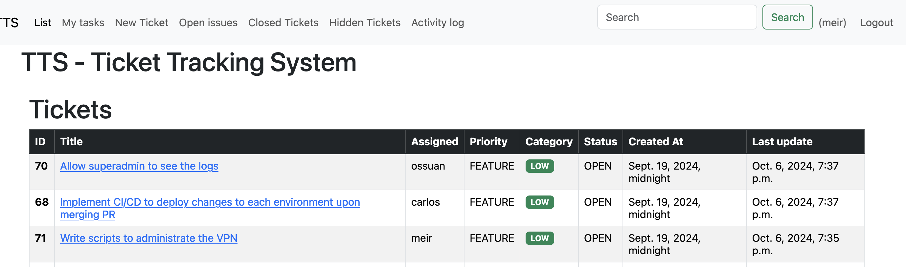

# Ticket Tracking System (TTS)

## Overview

Welcome to the Ticket Tracking System (TTS), a simple yet effective web-based tool designed to help users manage tickets, track progress, and log issues within an organization or project. The system enables users to create, assign, update, and comment on tickets while providing administrative control for organizing permissions and roles.

This project is built using Django and SQLAlchemy ORM, focusing on modularity, scalability, and ease of use.

## Features

	•	Create, Edit, and Delete Tickets: Users can manage tickets with essential details like title, description, priority, status, and category.
	•	Commenting System: Users can add comments to tickets, keeping discussions related to specific tasks in one place.
	•	Upvote/Downvote: Tickets and comments can be upvoted or downvoted by users to highlight priority and relevance.
	•	Role-based Access Control: Administrators can manage users’ roles and permissions for performing various actions on the tickets.
	•	Real-Time Status Updates: Each ticket’s status can be updated to track its lifecycle, from creation to completion.

## Setup and Installation

	1.	Clone the Repository:

git clone https://github.com/ticket-tracking-system.git
cd tts

	2.	Install Dependencies:

pip install -r requirements.txt

	3.	Apply Migrations:

python manage.py migrate

    4. Create a superuser:

python manage.py createsuperuser

    5.	Run the Development Server:

python manage.py runserver

    6. Login to the admin panel and create a few users

    7. Create a group to assign permissions to create and edit tickets.

    8. Assign the group to the users.    

	

	5.	Access the Application:
Open your web browser and navigate to http://localhost:8000.

How to Use

	1.	Creating a New Ticket:
	•	Click on “New Ticket” in the navigation menu to open the ticket creation form.
	•	Fill out the required fields, including title, description, priority, category, and assign it to a user.
	•	Submit the form to create the ticket.
	2.	Viewing and Updating Tickets:
	•	Navigate to the “List” page to view all tickets.
	•	Click on a specific ticket to view its details, update the status, or add comments.
	3.	Managing Comments:
	•	Open a ticket and scroll down to the comments section.
	•	Add a new comment or upvote/downvote existing ones.

Purpose and Goals

This Ticket Tracking System was created to showcase the use of Django and Django ORM for managing tickets and handling comments, permissions, and roles. It aims to provide a formal method for users to request changes and track issues, preventing an interrupt-driven work environment.

The inspiration for this system comes from Unix System Administrator’s Edition, highlighting the importance of having a structured process for managing requests and tasks.

License
Released under the MIT License.

This project is © 2024 RIUNX. All rights reserved.

Feel free to explore the code and contribute!