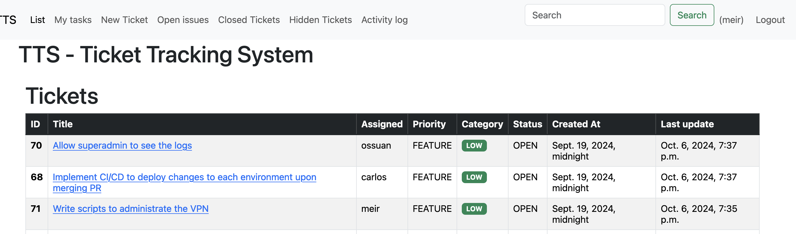

```diff
--- a/Users/meirm/git/cyborgfi/ticket-tracking-system/tickets/views.py
+++ b/Users/meirm/git/cyborgfi/ticket-tracking-system/tickets/views.py
@@ -1,14 +1,9 @@
-from django.http import JsonResponse
-from django.shortcuts import render, redirect
+# from django.shortcuts import render, redirect # No longer needed for DRF
 from .models import Changes, Ticket, Category, Status, Priority, Comment
 from django.contrib.auth.models import User, Group
 from django.conf import settings
-from django.views.decorators.csrf import csrf_exempt
-from accounts.auth import api_auth
-import json
 from rest_framework import generics, permissions, status, viewsets, serializers
 from rest_framework.decorators import action
 from rest_framework.response import Response
 from .serializers import TicketSerializer, CommentSerializer, UserSerializer, GroupSerializer
-
 def log_activity(ticket, request_user, log):
     actor = request_user if isinstance(request_user, User) else User.objects.get(pk=request_user.id)
     Changes.objects.create(
@@ -19,6 +14,8 @@
 
 class TicketViewSet(viewsets.ModelViewSet):
     serializer_class = TicketSerializer
+    # Add permissions - e.g., IsAuthenticatedOrReadOnly allows listing/detail for anyone, but creation/updates require auth
+    permission_classes = [permissions.IsAuthenticatedOrReadOnly]
 
     def get_queryset(self):
         user = self.request.user
@@ -132,236 +129,3 @@
             log_activity(ticket, self.request.user, "Added comment to ticket")
         except Ticket.DoesNotExist:
             raise serializers.ValidationError("Ticket not found.")
-
-def app_index(request):
-    return render(request, 'tickets/app_index.html')
-
-def privacy_view(request):
-    return render(request, 'tickets/privacy.html') 
-
-def terms_view(request):
-    return render(request, 'tickets/terms.html')
-
-@login_required
-def help_view(request):
-    return render(request, 'tickets/help.html')
-
-@login_required
-def list_issues(request):
-    ticket_list = Ticket.objects.all().filter(hidden=False) \
-    .filter(category__name="Bug") \
-    .exclude(status__closed=True) \
-    .order_by('-updated_at')
-    ticket_list = filter_tickets(request, ticket_list)
-            
-    paginator = Paginator(ticket_list, 10)
-    tickets_count = ticket_list.count()
-    tickets = paginator.get_page(request.GET.get('page'))
-    context = {
-        'tickets': tickets,
-        'page_title': 'Open Issues',
-        'tickets_count': tickets_count,
-    }
-    return render(request, 'tickets/index.html',context)
-    
-    
-@login_required
-def list_closed_tickets(request):
-    ticket_list = Ticket.objects.all().filter(hidden=False) \
-    .filter(status__closed=True) \
-    .order_by('-updated_at')
-    ticket_list = filter_tickets(request, ticket_list)
-    paginator = Paginator(ticket_list, 10)  # Show 10 tickets per page.
-    tickets_count = ticket_list.count()
-    page_number = request.GET.get('page')
-    tickets = paginator.get_page(page_number)
-    context = {
-            'tickets': tickets,
-            'page_title': 'Closed Tickets',
-            'tickets_count': tickets_count,
-        }
-    return render(request, 'tickets/index.html',context)
-
-@login_required
-def list_hidden_tickets(request):
-    ticket_list = Ticket.objects.all().filter(hidden=True).order_by('-updated_at')
-    ticket_list = filter_tickets(request, ticket_list)
-    paginator = Paginator(ticket_list, 10)  # Show 10 tickets per page.
-    tickets_count = ticket_list.count()
-    page_number = request.GET.get('page')
-    tickets = paginator.get_page(page_number)
-
-    context = {
-        'tickets': tickets,
-        'page_title': 'Hidden Tickets',
-        'tickets_count': tickets_count,
-    }
-    return render(request, 'tickets/index.html',context)
-
-@login_required
-def view_changes(request):
-    ticket_list = Changes.objects.all().order_by('-created_at') 
-    # FIXME: filter by permissions
-    paginator = Paginator(ticket_list, 10)
-    tickets_count = ticket_list.count()
-    page_number = request.GET.get('page')
-    changes = paginator.get_page(page_number)
-    return render(request, 'tickets/changes.html', {'changes': changes, 'tickets_count': tickets_count})
-
-@login_required
-def index(request):
-    ticket_list = Ticket.objects.filter(hidden=False).exclude(status__closed=True).order_by('-updated_at')
-    ticket_list = filter_tickets(request, ticket_list)
-    paginator = Paginator(ticket_list, 10)  # Show 10 tickets per page.
-    tickets_count = ticket_list.count()
-    page_number = request.GET.get('page')
-    tickets = paginator.get_page(page_number)
-
-    context = {
-        'tickets': tickets,
-        'page_title': 'Tickets',
-        'tickets_count': tickets_count,
-    }
-    return render(request, 'tickets/index.html',context)
-
-@login_required
-def ticket_detail(request, ticket_id):
-    ticket = Ticket.objects.get(pk=ticket_id)
-    ticket = filter_ticket(request, ticket)
-    if not ticket:
-        messages.error(request, 'You do not have permission to view this ticket')
-        return redirect('tickets:index')
-    return render(request, 'tickets/ticket_detail.html', {'ticket': ticket, 'comments': ticket.comments.all().order_by('-created_at')})
-
-@login_required
-def search_tickets(request):
-    # We want to search for tickets based on the title and description fields.
-    # check the browser history for the query to see if the search was done when showing all tasks, mine, closed, or hidden
-    if 'q' not in request.GET:
-        return redirect('tickets:index')
-    query = request.GET['q']
-    if not query:
-        return redirect('tickets:index')
-    # get history from browser
-    history = request.META.get('HTTP_REFERER').split('/')[-2]
-    
-    # check if the search was done when showing all tasks
-     #check if it matches a user
-    if User.objects.filter(username__icontains=query).exists():
-        all_tickets = Ticket.objects.filter(assignee=User.objects.get(username__icontains=query))
-    else:
-        all_tickets = Ticket.objects.filter(title__icontains=query) | Ticket.objects.filter(description__icontains=query)
-    if 'my' in history:
-        tickets = all_tickets.filter(assignee=request.user)
-    # check if the search was done when showing hidden tasks
-    elif 'hidden' in history:
-        tickets = all_tickets.filter(hidden=True)
-        
-    else:
-        tickets = all_tickets.filter(hidden=False)
-    if 'closed' in history:
-        tickets = tickets.filter(status__closed=True)
-    else:
-        tickets = tickets.exclude(status__closed=True)
-    if tickets.count() == 0:
-        messages.error(request, f'No tickets found for "{query}"')
-    else:
-        messages.success(request, f'Search results for "{query}" coming from {history}')
-    tickets = filter_tickets(request, tickets)
-    ticket_list = tickets.order_by('-updated_at')
-    
-    paginator = Paginator(tickets, 10)
-    tickets_count = ticket_list.count()
-    page_number = request.GET.get('page')
-    tickets = paginator.get_page(page_number)
-    context = {
-        'tickets': tickets,
-        'page_title': 'Search results',
-        'tickets_count': tickets_count,
-    }
-    return render(request, 'tickets/index.html',context)
-    
-
-@login_required
-def my_tasks(request):
-    ticket_list = Ticket.objects.filter(hidden=False, assignee=request.user).exclude(status__closed=True).order_by('-updated_at')
-    ticket_list = filter_tickets(request, ticket_list)
-    paginator = Paginator(ticket_list, 10)
-    tickets_count = ticket_list.count()
-    page_number = request.GET.get('page')
-    tickets = paginator.get_page(page_number)
-
-    context = {
-        'tickets': tickets,
-        'page_title': 'My tasks',
-        'tickets_count': tickets_count,
-    }
-    return render(request, 'tickets/index.html',context)
-
-@login_required
-def in_progress_view(request):
-    ticket_list = Ticket.objects.filter(hidden=False, status__name = "In Progress").order_by('-updated_at')
-    ticket_list = filter_tickets(request, ticket_list)
-    paginator = Paginator(ticket_list, 10)
-    tickets_count = ticket_list.count()
-    page_number = request.GET.get('page')
-    tickets = paginator.get_page(page_number)
-    context = {
-        'tickets': tickets,
-        'page_title': 'In Progress',
-        'tickets_count': tickets_count,
-    }
-    return render(request, 'tickets/index.html',context)
-
-@login_required
-def new_ticket(request):
-    if not request.user.has_perm('tickets.add_ticket'):
-        messages.error(request, 'You do not have permission to create a ticket')
-        return redirect('tickets:index')
-    if request.method == 'POST':
-        user = User.objects.get(pk=request.user.id)
-        title = request.POST['title']
-        description = request.POST['description']
-        status = request.POST['status']
-        priority = request.POST['priority']
-        category = request.POST['category']
-        assignee = User.objects.get(pk=request.POST['assignee'])
-        due_date = request.POST['due_date']
-        if due_date == "":
-            due_date = None
-        if not assignee:
-            assignee = user
-        
-        ticket = Ticket.objects.create(
-            issuer=request.user,
-            assignee=assignee,
-            title=title,
-            description=description,
-            status=Status.objects.get(id=status),
-            priority=Priority.objects.get(id=priority),
-            category=Category.objects.get(id=category),
-            due_date=due_date
-        )
-        log_activity(ticket, request.user, "Created ticket")
-        return render(request, 'tickets/ticket_detail.html', {'ticket': ticket})
-    else:
-        return render(request, 'tickets/new_ticket.html', {"form": TicketForm()})
-    
-@login_required
-def edit_ticket(request, ticket_id):
-    ticket = Ticket.objects.get(pk=ticket_id)
-    ticket = filter_ticket(request, ticket)
-    if not ticket:
-        messages.error(request, 'You do not have permission to edit this ticket')
-        return redirect('tickets:index')
-    if request.method == 'POST':
-        # We want to create a new comment entry with the details of the changes made to the ticket.
-        changes = []
-        if User.objects.get(pk=request.POST['assignee']).id != ticket.assignee.id:
-            try:
-                changes.append(f"Assigned: {ticket.assignee} -> {User.objects.get(pk=request.POST['assignee'])}")
-            except User.DoesNotExist:
-                return JsonResponse({'error': 'Invalid assignee'}, status=400)
-        # Return error if the priority value is not a valid Priority names
-        
-        if request.POST['priority']:
-            if not Priority.objects.filter(pk=request.POST['priority']).exists():
-                return JsonResponse({'error': 'Invalid priority value'}, status=400)
-            priority = Priority.objects.get(pk=request.POST['priority'])
-            if priority != ticket.priority:
-                changes.append(f"Priority: {ticket.priority.name} -> {priority.name}")
-        if request.POST['category']:
-            if not Category.objects.filter(pk=request.POST['category']).exists():
-                return JsonResponse({'error': 'Invalid category value'}, status=400)
-            category = Category.objects.get(pk=request.POST['category'])
-            if category != ticket.category:
-                changes.append(f"Category: {ticket.category.name} -> {category.name}")
-        if request.POST['status']:
-            if not Status.objects.filter(pk=request.POST['status']).exists():
-                return JsonResponse({'error': 'Invalid status value'}, status=400)
-            status = Status.objects.get(pk=request.POST['status'])
-            if status != ticket.status:
-                changes.append(f"Status: {ticket.status.name} -> {status.name}")
-        if request.POST['assigned_group']:
-            if not Group.objects.filter(pk=request.POST['assigned_group']).exists():
-                return JsonResponse({'error': 'Invalid group value'}, status=400)
-            assigned_group = Group.objects.get(pk=request.POST['assigned_group'])
-            if ticket.assigned_group is None:
-                changes.append(f"Assigned group: None -> {assigned_group.name}")
-            elif assigned_group != ticket.assigned_group:
-                changes.append(f"Assigned group: {ticket.assigned_group.name} -> {assigned_group.name}")
-                
-        if request.POST['title'] != ticket.title:
-            changes.append(f"Title: {ticket.title} -> {request.POST['title']}")
-        if request.POST['description'] != ticket.description:
-            changes.append(f"Description: {ticket.description} -> {request.POST['description']}")
-       
-        
-        # we have an issue with the date format, it is  reporting Due date: 2024-10-08 00:00:00+00:00 -> 2024-10-08 when actually the date is 2024-10-08 00:00:00
-        # we need to fix this, we can use the date filter to format the date
-        ticket_due_date = ticket.due_date.isoformat() if ticket.due_date else ""
-        if request.POST['due_date'] != "" and request.POST['due_date'] != ticket_due_date:
-            changes.append(f"Due date: {ticket.due_date} -> {request.POST['due_date']}")
-        if changes:
-            ticket.comments.create(
-                author=request.user,
-                comment=";\n".join(changes)
-            )
-            messages.success(request, f'Ticket #{ticket_id}  updated successfully')
-            log_activity(ticket, request.user, "Changes to ticket")
-        ticket.title = request.POST['title']
-        ticket.description = request.POST['description']
-        ticket.priority = Priority.objects.get(pk=request.POST['priority'])
-        ticket.category = Category.objects.get(pk=request.POST['category'])
-        ticket.assignee = User.objects.get(pk=request.POST['assignee'])
-        ticket.status = Status.objects.get(pk=request.POST['status'])
-        ticket.assigned_group = Group.objects.get(pk=request.POST['assigned_group'])
-        if request.POST['due_date'] != "":
-            ticket.due_date = request.POST['due_date']
-        ticket.save()
-        return redirect('tickets:ticket_detail', ticket_id=ticket_id)
-    else:
-        return render(request, 'tickets/edit_ticket.html', {'ticket': ticket, 'edit_form': TicketForm(instance=ticket)})
-    
-@login_required
-def hide_ticket(request, ticket_id):
-    ticket = Ticket.objects.get(pk=ticket_id)
-    ticket = filter_ticket(request, ticket)
-    if not ticket:
-        messages.error(request, 'You do not have permission to hide this ticket')
-        return redirect('tickets:index')
-    ticket.hidden = True
-    ticket.save()
-    messages.success(request, f'Ticket {ticket_id} hidden successfully')
-    log_activity(ticket, request.user, "Hided ticket")
-    return redirect('tickets:index')
-
-@login_required
-def unhide_ticket(request, ticket_id):
-    ticket = Ticket.objects.get(pk=ticket_id)
-    ticket = filter_ticket(request, ticket)
-    if not ticket:
-        messages.error(request, 'You do not have permission to unhide this ticket')
-        return redirect('tickets:index')
-    ticket.hidden = False
-    ticket.save()
-    messages.success(request, f'Ticket #{ticket_id} unhidden successfully')
-    log_activity(ticket, request.user, "Ticket unhiden")
-    return redirect('tickets:index')
-
-@login_required
-def new_comment(request, ticket_id):
-    ticket = Ticket.objects.get(pk=ticket_id)
-    ticket = filter_ticket(request, ticket)
-    if not ticket:
-        messages.error(request, 'You do not have permission to add a comment to this ticket')
-        return redirect('tickets:index')
-    if request.method == 'POST':
-        comment = request.POST['comment']
-        ticket.comments.create(
-            author=request.user,
-            comment=comment
-        )
-        messages.success(request, f'Comment added successfully to the ticket #{ticket_id}' )
-        log_activity(ticket, request.user, "Added comment to ticket")
-        return redirect('tickets:ticket_detail', ticket_id=ticket_id)
-    else:
-        return render(request, 'tickets/new_comment.html', {'comment_form':CommentForm(),'ticket': ticket})
-    
-@login_required
-def edit_comment(request, ticket_id, comment_id):
-    ticket = Ticket.objects.get(pk=ticket_id)
-    ticket = filter_ticket(request, ticket)
-    if not ticket:
-        messages.error(request, 'You do not have permission to edit a comment in this ticket')
-        return redirect('tickets:index')
-    comment = ticket.comments.get(pk=comment_id)
-    if request.method == 'POST':
-        comment.comment = request.POST['comment']
-        comment.save()
-        messages.success(request, f'Comment updated successfully to ticket #{ticket_id}')
-        log_activity(ticket, request.user, "Edited comment in ticket")
-        return render(request, 'tickets/ticket_detail.html', {'ticket': ticket})
-    else:
-        return render(request, 'tickets/edit_comment.html', {'ticket': ticket, 'comment': comment})
-    
-@login_required
-def delete_comment(request, ticket_id, comment_id):
-    ticket = Ticket.objects.get(pk=ticket_id)
-    ticket = filter_ticket(request, ticket)
-    if not ticket:
-        messages.error(request, 'You do not have permission to delete a comment in this ticket')
-        return redirect('tickets:index')
-    comment = ticket.comment_set.get(pk=comment_id)
-    comment.delete()
-    return render(request, 'tickets/ticket_detail.html', {'ticket': ticket})
-
-@login_required
-def upvote_ticket(request, ticket_id):
-    ticket = Ticket.objects.get(pk=ticket_id)
-    ticket.upvotes += 1
-    ticket.save()
-    return render(request, 'tickets/ticket_detail.html', {'ticket': ticket})
-
-@login_required
-def downvote_ticket(request, ticket_id):
-    ticket = Ticket.objects.get(pk=ticket_id)
-    ticket.downvotes += 1
-    ticket.save()
-    return render(request, 'tickets/ticket_detail.html', {'ticket': ticket})
-
-@login_required
-def upvote_comment(request, ticket_id, comment_id):
-    ticket = Ticket.objects.get(pk=ticket_id)
-    comment = ticket.comment_set.get(pk=comment_id)
-    comment.upvotes += 1
-    comment.save()
-    return render(request, 'tickets/ticket_detail.html', {'ticket': ticket})
-
-@login_required
-def downvote_comment(request, ticket_id, comment_id):
-    ticket = Ticket.objects.get(pk=ticket_id)
-    comment = ticket.comment_set.get(pk=comment_id)
-    comment.downvotes += 1
-    comment.save()
-    return render(request, 'tickets/ticket_detail.html', {'ticket': ticket})
```

```diff
--- a/Users/meirm/git/cyborgfi/ticket-tracking-system/core/settings.py
+++ b/Users/meirm/git/cyborgfi/ticket-tracking-system/core/settings.py
@@ -36,6 +36,7 @@
     'django.contrib.staticfiles',
     'reset_migrations',
     'rest_framework',
+    'rest_framework.authtoken', # Add authtoken app
     'graphene_django',
     'accounts',
     'tickets',
@@ -166,3 +167,16 @@
 GRAPHENE = {
     "SCHEMA": "core.schema.schema"
 }
+
+# Django REST Framework settings
+REST_FRAMEWORK = {
+    'DEFAULT_AUTHENTICATION_CLASSES': [
+        # Primarily use Token Authentication for external clients
+        'rest_framework.authentication.TokenAuthentication',
+        # Session Authentication is useful for the browsable API
+        'rest_framework.authentication.SessionAuthentication',
+    ],
+    'DEFAULT_PERMISSION_CLASSES': [
+        'rest_framework.permissions.IsAuthenticated', # Default to requiring authentication
+    ]
+}
```

```diff
--- a/Users/meirm/git/cyborgfi/ticket-tracking-system/accounts/views.py
+++ b/Users/meirm/git/cyborgfi/ticket-tracking-system/accounts/views.py
@@ -1,50 +1,50 @@
-from django.shortcuts import render, redirect
-from django.contrib.auth import authenticate, login, logout
-from django.contrib import messages
+# Remove imports no longer needed
+# from django.shortcuts import render, redirect
+# from django.contrib.auth import authenticate, login, logout
+# from django.contrib import messages
 from django.contrib.auth.models import User
-from django.contrib.auth.decorators import login_required
-from django.views.decorators.http import require_POST
+# from django.contrib.auth.decorators import login_required
+# from django.views.decorators.http import require_POST
+
+# Keep utils if Activity logging is still desired
 from .utils import log_activity
 from .models import Activity, ApiKey
-from rest_framework.decorators import api_view, permission_classes
-from rest_framework.permissions import IsAuthenticated
+
+# DRF Imports
+# from rest_framework.decorators import api_view, permission_classes # Use ViewSet actions instead
+from rest_framework import viewsets, status, permissions
+from rest_framework.decorators import action
 from rest_framework.response import Response
-from rest_framework import status
 from .serializers import ApiKeySerializer
 
-@login_required
-def api_key_delete(request, key):
-    try:
-        key_obj = ApiKey.objects.get(key=key, user=request.user)
-        key_obj.delete()
-        log_activity(request.user, 'DELETE', level='INFO', log='API key deleted.')
-        return Response(status=status.HTTP_204_NO_CONTENT)
-    except ApiKey.DoesNotExist:
-        return Response({'error': 'API Key not found or permission denied'}, status=status.HTTP_404_NOT_FOUND)
+class ApiKeyViewSet(viewsets.ModelViewSet):
+    """
+    API endpoint that allows API Keys to be viewed, created, activated, deactivated, or deleted.
+    """
+    serializer_class = ApiKeySerializer
+    permission_classes = [permissions.IsAuthenticated] # Only authenticated users can manage keys
 
-@login_required
-def api_key_activate(request, key):
-    try:
-        key_obj = ApiKey.objects.get(key=key, user=request.user)
-        key_obj.activate()
+    def get_queryset(self):
+        """
+        This view should return a list of all the API keys
+        for the currently authenticated user.
+        """
+        return ApiKey.objects.filter(user=self.request.user)
+
+    def perform_create(self, serializer):
+        """
+        Associate the key with the logged-in user and log activity.
+        """
+        instance = serializer.save(user=self.request.user)
+        log_activity(self.request.user, 'CREATE', level='INFO', log=f'API key created for {instance.application}.')
+
+    @action(detail=True, methods=['post'])
+    def activate(self, request, pk=None):
+        key_obj = self.get_object() # get_object handles 404 and permission checks based on queryset
+        key_obj.activate() # Assumes activate() method exists on model
         log_activity(request.user, 'UPDATE', level='INFO', log='API key activated.')
-        serializer = ApiKeySerializer(key_obj)
+        serializer = self.get_serializer(key_obj)
         return Response(serializer.data)
-    except ApiKey.DoesNotExist:
-        return Response({'error': 'API Key not found or permission denied'}, status=status.HTTP_404_NOT_FOUND)
 
-@login_required
-def api_key_deactivate(request, key):
-    try:
-        key_obj = ApiKey.objects.get(key=key, user=request.user)
-        key_obj.deactivate()
+    @action(detail=True, methods=['post'])
+    def deactivate(self, request, pk=None):
+        key_obj = self.get_object()
+        key_obj.deactivate() # Assumes deactivate() method exists on model
         log_activity(request.user, 'UPDATE', level='INFO', log='API key deactivated.')
-        serializer = ApiKeySerializer(key_obj)
+        serializer = self.get_serializer(key_obj)
         return Response(serializer.data)
-    except ApiKey.DoesNotExist:
-        return Response({'error': 'API Key not found or permission denied'}, status=status.HTTP_404_NOT_FOUND)
-
-@api_view(['POST'])
-@permission_classes([IsAuthenticated])
-def api_key_create_drf(request):
-    application_name = request.data.get('application')
-    if not application_name:
-        return Response({'error': 'Application name is required'}, status=status.HTTP_400_BAD_REQUEST)
-
-    api_key = ApiKey(application=application_name,
-                     user=request.user)
-    api_key.save()
-    log_activity(request.user, 'CREATE', level='INFO', log=f'API key created for {application_name}.')
-    serializer = ApiKeySerializer(api_key)
-    return Response(serializer.data, status=status.HTTP_201_CREATED)
+
+# Remove old function-based views
+# def api_key_delete(request, key): ...
+# def api_key_activate(request, key): ...
+# def api_key_deactivate(request, key): ...
+# def api_key_create_drf(request): ...
+# def login_view(request): ... # Replace with DRF auth endpoint
```

```diff
--- a/Users/meirm/git/cyborgfi/ticket-tracking-system/accounts/urls.py
+++ b/Users/meirm/git/cyborgfi/ticket-tracking-system/accounts/urls.py
@@ -1,17 +1,16 @@
-from django.urls import path
+from django.urls import path, include
 from . import views
+# Import DRF router
+from rest_framework.routers import DefaultRouter
+
+# Import ViewSet
+from .views import ApiKeyViewSet
 
 app_name = 'accounts'
+
+# Create a router and register our viewsets with it.
+router = DefaultRouter()
+router.register(r'keys', views.ApiKeyViewSet, basename='apikey')
+
 urlpatterns = [
-    path('login/', views.login_view, name='login'),
-    # Remove UI related views - replace with DRF endpoints if needed
-    # path('logout/', views.logout_view, name='logout'),
-    # path('profile/', views.profile_view, name='profile'),
-    # path('admin_board/', views.admin_board_view, name='admin_board'), # Admin board could be an API endpoint
-    # path('password/change/', views.password_change_view, name='password_change'),
-    # path('key/', views.api_key_view, name='api_keys'), # API Key management should be API endpoints
-    path('key/create/', views.api_key_create, name='api_key_create'),
-    path('key/deactivate/<str:key>/', views.api_key_deactivate, name='api_key_disable'),
-    path('key/activate/<str:key>/', views.api_key_activate, name='api_key_enable'),
-    path('key/delete/<str:key>/', views.api_key_delete, name='api_key_delete'),
-    # Add other DRF endpoints for auth, profile, etc. here
-    path('key/create_drf/', views.api_key_create_drf, name='api_key_create_drf'), # Added DRF version
+    path('', include(router.urls)), # Include the router-generated URLs
+    # Add other API paths here if needed (e.g., for token auth endpoints from dj-rest-auth)
 ]
```

```diff
--- a/Users/meirm/git/cyborgfi/ticket-tracking-system/README.md
+++ b/Users/meirm/git/cyborgfi/ticket-tracking-system/README.md
@@ -1,18 +1,15 @@
 # Ticket Tracking System (TTS) API
 
-
-
 ## Overview
 
-Welcome to the Ticket Tracking System (TTS), a simple yet effective web-based tool designed to help manage tickets, track progress, and log issues within an organization or project. Users can create, assign, update, and comment on tickets, with administrative controls for managing permissions and roles.
+Welcome to the Ticket Tracking System (TTS) API backend. This is a Django REST Framework application designed to manage tickets, track progress, and log issues programmatically.
 
-This project is built using **Django** and **SQLAlchemy ORM**, emphasizing modularity, scalability, and ease of use.
+This project is built using **Django** and **Django REST Framework (DRF)**, emphasizing modularity, scalability, and API-first principles.
 
 ## Features
 
 - **Create, Edit, and Delete Tickets**: Manage tickets with essential details like title, description, priority, status, and category via API endpoints.
 - **Commenting System**: Add and manage comments on tickets through the API.
-- **Upvote/Downvote**: Highlight priority and relevance by upvoting or downvoting tickets and comments.
 - **Role-based Access Control**: Administrators manage user roles and permissions (via Django Admin or API). API endpoints respect these permissions.
 - **Real-Time Status Updates**: Track the lifecycle of each ticket through API interactions.
 
@@ -44,27 +41,13 @@
 	python manage.py createsuperuser
 	```
 
-5.	**Run the Development Server**:
+5.	**Run the API Server**:
 
 	```
 	python manage.py runserver
 	```
 
-6.	**Login to the Admin Panel**:
-
-Visit http://localhost:8000/admin and log in with your superuser account.
-
-7.	**Create a Group**:
-
-Create a group in the admin panel and assign it permissions to create and edit tickets.
-
-8.	**Assign Users to the Group**:
-Assign the group to the users who should have ticket creation and editing permissions.
-
-## Access the Application
-
-Open your web browser and navigate to http://localhost:8000.
+The API is now accessible, typically at `http://localhost:8000/tickets/api/v1/`. You can use the Django Admin (`/admin/`) to manage users, groups, and initial setup.
 
 ## How to Use
 
@@ -82,15 +65,15 @@
 	•	Open a ticket and scroll to the comments section.
 	•	Add new comments or upvote/downvote existing comments.
 
+## API Usage
+
+- **Authentication**: Obtain an authentication token (e.g., via a dedicated endpoint or admin command) and include it in the `Authorization` header: `Authorization: Token YOUR_TOKEN_HERE`.
+- **Endpoints**: Interact with the API using standard HTTP methods (GET, POST, PUT, PATCH, DELETE) on the provided endpoints (e.g., `/tickets/api/v1/tickets/`, `/tickets/api/v1/comments/`, `/accounts/api/v1/keys/`). Refer to the API documentation (e.g., generated via Swagger/OpenAPI or `ai_docs/api_integration.md`) for details.
+
 ## Purpose and Goals
 
-The Ticket Tracking System was developed to demonstrate the use of Django and Django ORM for managing tickets and handling comments, permissions, and roles. It provides a formal method for users to request changes and track issues, promoting a structured workflow and reducing interruptions.
-
-This system draws inspiration from Unix System Administrator’s Edition, showcasing the importance of a structured process for managing requests and tasks.
+The Ticket Tracking System API provides a backend for managing tickets, comments, permissions, and roles programmatically. It allows integration with other systems or custom frontends.
 
 ## License
 

```

```bash
# Deleting pages directory
rm -rf /Users/meirm/git/cyborgfi/ticket-tracking-system/pages/
# Deleting auth.py
rm /Users/meirm/git/cyborgfi/ticket-tracking-system/accounts/auth.py
# Deleting authorization.py
rm /Users/meirm/git/cyborgfi/ticket-tracking-system/tickets/authorization.py

```